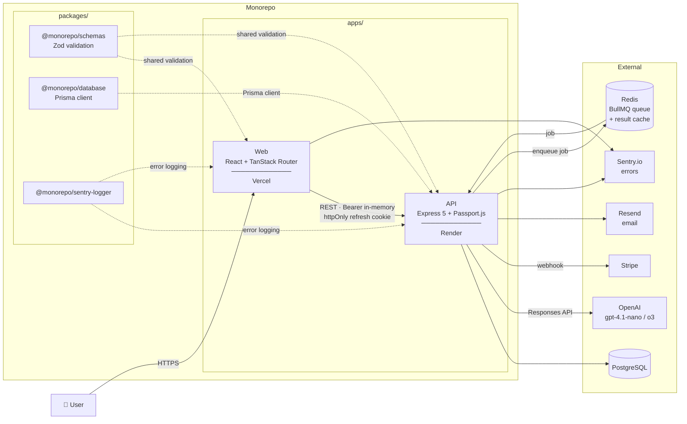
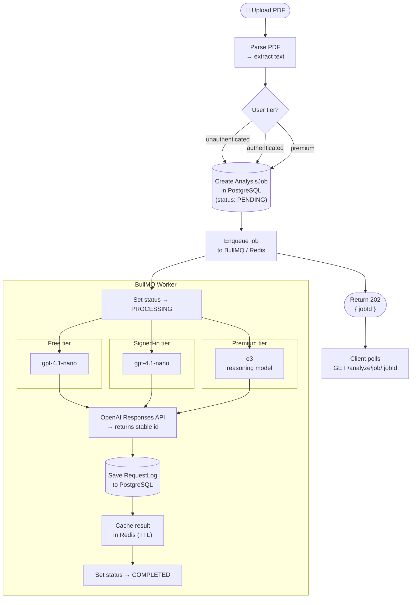
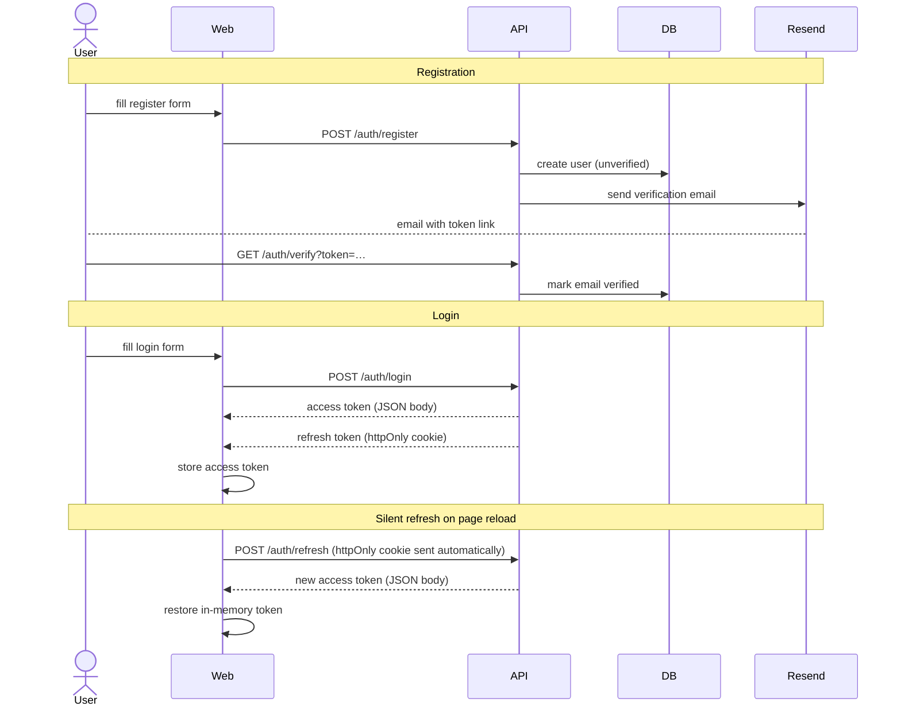

# ATS Resume Analyzer

An intelligent web application that analyzes resumes for compatibility with Applicant Tracking Systems (ATS). Upload your CV and get instant feedback on how well it will perform in automated screening systems.

🚀 **Live Demo**: [https://ats-scan.patrykbarc.com/](https://ats-scan.patrykbarc.com/)

## Architecture

### Architecture Overview



### Resume Analysis Flow



### Auth Flow



## Features

- 📄 PDF resume parsing and analysis
- 🤖 AI-powered evaluation using OpenAI
- 📊 Detailed ATS compatibility scoring
- 💡 Actionable recommendations for improvement
- ⚡ Async analysis processing via BullMQ job queue
- 🔐 User authentication
- 📧 Email verification with Resend
- ⭐ Premium subscription system
- 🛡️ Rate limiting and security
- 🔍 Error tracking with Sentry
- 🧪 Unit + E2E tests

## Tech Stack

### Frontend

- React 19
- TypeScript
- Vite
- Tailwind CSS 4
- TanStack Router & Query
- Zustand
- Shadcn UI
- Axios

### Backend

- Node.js
- Express
- TypeScript
- OpenAI API
- Passport.js
- Prisma ORM
- PostgreSQL
- Redis
- BullMQ
- Resend
- Multer
- Sentry

### Monorepo

- pnpm workspaces
- Shared packages for types, schemas, database, constants, and Sentry logging

## Prerequisites

Before you begin, ensure you have the following installed:

- **Node.js** (v24 or higher)
- **pnpm** (v10 or higher)
- **PostgreSQL** database
- **Redis** instance (local or managed, e.g. Upstash)
- **OpenAI API Key** - Get one from [OpenAI Platform](https://platform.openai.com/)
- **Resend API Key** - For email verification

## Getting Started

### 1. Clone the Repository

```bash
git clone <repository-url>
cd ats-resume-analyzer
```

### 2. Install Dependencies

```bash
pnpm install
```

### 3. Environment Configuration

#### API Configuration

Create a `.env` file in `apps/api/` directory:

```bash
cd apps/api
cp .env.template .env
```

Edit `apps/api/.env` and configure the following variables:

```env
NODE_ENV=development
PORT=8080

# OpenAI API Key
OPENAI_API_KEY=your_openai_api_key_here

# Frontend URL for CORS
FRONTEND_URL=http://localhost:5173

# JWT Secrets - generate with: pnpm --filter @monorepo/api gen-key
JWT_SECRET=your_jwt_secret_here
JWT_REFRESH_SECRET=your_jwt_refresh_secret_here

# Database
DATABASE_URL=your_postgresql_connection_string
DIRECT_URL=your_postgresql_direct_connection_string

# Email
RESEND_API_KEY=your_resend_api_key_here
EMAIL_SENDER=sender@example.com

# Stripe
STRIPE_SECRET_KEY=your_stripe_secret_key
STRIPE_WEBHOOK_SECRET=your_stripe_webhook_secret

# Stripe price
STRIPE_PRICE_ID=your_stripe_price_id

# Cron
CRON_SECRET_KEY=your_random_cron_key

# Sentry
SENTRY_DSN=your_sentry_dsn_here

# Redis (used by BullMQ job queue and result cache)
REDIS_URL=redis://localhost:6379
```

#### Web Configuration

Create a `.env` file in `apps/web/` directory:

```bash
cd apps/web
cp .env.template .env
```

Edit `apps/web/.env` and configure the following variables:

```env
VITE_NODE_ENV="development"

# API server URL for frontend requests
VITE_API_URL=http://localhost:8080

# Frontend URL for CORS and email links
VITE_FRONTEND_URL=http://localhost:5173

# Stripe public key for payment forms
VITE_PAYMENT_PUBLIC_KEY=your_stripe_public_key

# Contact email displayed in the application
VITE_CONTACT_EMAIL=your_contact_email

# Sentry DSN for error tracking on frontend
VITE_SENTRY_DSN=your_sentry_dsn_here
```

After editing env files, regenerate typed envs from repo root: `pnpm gen-envs`

### 4. Running the Application

#### Development Mode

Run both frontend and backend simultaneously from root directory:

```bash
pnpm dev
```

Or run them separately:

```bash
# Terminal 1 - Run API server
pnpm dev:api

# Terminal 2 - Run web application
pnpm dev:web
```

The application will be available at:

- **Frontend**: http://localhost:5173
- **Backend API**: http://localhost:8080

Optional quick setup (install dependencies, build packages and generate Prisma client):

```bash
pnpm dev:setup
```

### 5. Database Setup

Run database migrations:

```bash
pnpm db:migrate
```

Generate Prisma client:

```bash
pnpm db:generate
```

#### Production Build

```bash
pnpm build
```

## Architecture & Technology Decisions

Key decisions made during development and the reasoning behind them:

### pnpm Monorepo with Shared Packages

A single pnpm workspace hosts both apps (`api`, `web`) and five shared packages (`database`, `types`, `schemas`, `constants`, `sentry-logger`). This lets the Zod schemas that validate API request bodies be reused directly in the React forms — a single source of truth that eliminates drift between frontend validation and backend enforcement. The `pnpm catalogs` feature pins shared dependency versions (Zod, Stripe, TypeScript, etc.) across all packages without duplicating version strings.

### TanStack Router over React Router

TanStack Router provides file-based routing with full TypeScript inference for route params and search params. This avoids runtime `useParams()` / `useSearchParams()` casts and makes navigation type-safe end-to-end. The generated route tree is committed, so route changes are caught at compile time rather than at runtime.

### Tiered AI Models (gpt-4.1-nano / o3)

Free and signed-in analyses use `gpt-4.1-nano` (fast, low-cost). Premium analyses use `o3` (reasoning model, higher accuracy). The tier is determined server-side after verifying the subscription, so the model choice cannot be spoofed by the client.

### OpenAI Responses API

The backend uses the OpenAI **Responses API** (`openAiClient.responses.create`) rather than the legacy Chat Completions API. The Responses API returns a stable `id` alongside the output text, which is stored and used as the analysis record's primary key — enabling idempotent webhook re-delivery without duplicating records.

### Async Analysis via BullMQ

AI analysis runs inside a BullMQ worker rather than inline in the HTTP request handler. The API creates an `AnalysisJob` record in PostgreSQL, enqueues the job to Redis, and immediately returns `202 Accepted` with a `jobId`. The worker processes the job independently — calling OpenAI, saving the `RequestLog`, caching the result in Redis, and updating the job status. The client polls `GET /analyze/job/:jobId` until the job is `COMPLETED` or `FAILED`. This keeps request latency predictable, prevents HTTP timeouts on slow AI responses, and decouples the web tier from the processing tier.

### Vitest for Testing

Vitest is ESM-native and shares configuration with the existing Vite/tsup build toolchain, eliminating the CJS/ESM transform issues that arise when using Jest with this stack. A single test runner covers both the Node.js API (`environment: 'node'`) and the React frontend (`environment: 'jsdom'`).

### Express 5

Express 5 is used for the API server. Compared to Express 4, async route handlers propagate thrown errors to the error middleware automatically — no need for `try/catch` wrappers or `next(err)` calls in every handler.

### Sentry for Error Tracking

Sentry is used instead of plain `console.error` or Pino for production error tracking. Unlike a file logger, Sentry captures full stack traces, request context, and user metadata, then surfaces them in a searchable dashboard — making it practical to detect and triage production errors without digging through log files. The integration lives in the `sentry-logger` shared package so both the API and any future service share a single, consistently-configured client.

### In-Memory Access Token Storage

The JWT access token is stored in a module-level JavaScript variable (`tokenStorage.ts`) rather than `localStorage`. This eliminates XSS exposure: scripts injected on any page of the domain cannot read the token. Sessions survive tab navigation because the token lives in the JS heap. Page refresh re-hydrates the token silently via the `httpOnly` refresh token cookie (`POST /auth/refresh`), which is inaccessible to JavaScript.

---

## Project Structure

```
ats-resume-analyzer/
├── apps/
│   ├── api/                 # Backend Express server
│   │   ├── src/
│   │   │   ├── config/      # Configuration (CORS, Passport, Pino, etc.)
│   │   │   ├── controllers/ # Request handlers
│   │   │   ├── lib/         # Utilities and helpers
│   │   │   ├── middleware/  # Express middleware (auth, rate limit, validation)
│   │   │   ├── prompt/      # AI prompts (standard & pro)
│   │   │   ├── routes/      # API routes
│   │   │   ├── services/    # Business logic (auth, email, analysis)
│   │   │   ├── templates/   # Email templates
│   │   │   └── workers/     # BullMQ job workers
│   │   └── package.json
│   └── web/                 # Frontend React application
│       ├── src/
│       │   ├── api/         # API client & React Query
│       │   ├── components/  # React components (UI, views, icons)
│       │   ├── hooks/       # Custom React hooks
│       │   ├── lib/         # Utilities
│       │   ├── routes/      # TanStack Router routes
│       │   ├── services/    # API services
│       │   └── stores/      # Zustand stores
│       └── package.json
├── packages/
│   ├── database/           # Prisma ORM & PostgreSQL
│   │   └── prisma/         # Schema & migrations
│   ├── constants/          # Shared constants
│   ├── schemas/            # Shared Zod schemas
│   ├── types/              # Shared TypeScript types
│   └── sentry-logger/      # Sentry error logging
├── scripts/                # Utility scripts
└── package.json
```

## Available Scripts

### Development

- `pnpm dev` - Run both frontend and backend in development mode
- `pnpm dev:api` - Run only the API server
- `pnpm dev:web` - Run only the web application

### Build

- `pnpm build` - Build all packages and applications
- `pnpm build:api` - Build only API and its dependencies
- `pnpm build:web` - Build only web and its dependencies

### Production

- `pnpm start:api` - Start API server in production mode

### Type Checking

- `pnpm type-check` - Run type checks across all packages
- `pnpm tsc` - Run TypeScript compiler check on all packages
- `pnpm tsc:web` - Run TypeScript compiler check on web only
- `pnpm tsc:api` - Run TypeScript compiler check on API only

### Database

- `pnpm db:migrate` - Run database migrations (development)
- `pnpm db:generate` - Generate Prisma client (development)
- `pnpm db:migrate:prod` - Run database migrations (production)
- `pnpm db:generate:prod` - Generate Prisma client (production)
- `pnpm db:studio` - Open Prisma Studio
- `pnpm db:reset` - Reset database

### Testing

- `pnpm test` — Run unit tests across all packages
- `pnpm test:e2e` — Run Playwright end-to-end tests

### Other

- `pnpm lint` - Run ESLint linter
- `pnpm prettier` - Format code with Prettier
- `pnpm gen-envs` - Generate TypeScript types from environment variables
- `pnpm clear` - Remove all build artifacts and dist folders

## API Endpoints

### Authentication

#### `POST /api/auth/register`

Register a new user account.

#### `POST /api/auth/login`

Login and receive JWT tokens.

#### `POST /api/auth/refresh`

Refresh access token.

#### `POST /api/auth/logout`

Logout and invalidate tokens.

#### `GET /api/auth/me`

Get current user information (protected).

#### `POST /api/auth/verify`

Verify email with confirmation token.

#### `POST /api/auth/verify/resend`

Resend email verification link.

#### `POST /api/auth/password/request-reset`

Request password reset link.

#### `POST /api/auth/password/reset`

Reset password with token.

### Resume Analysis

Endpoints are under `/api/cv`:

#### Submit analysis

- `POST /api/cv/analyze/free` — public analysis, multipart with `file`
- `POST /api/cv/analyze/signed-in` — requires auth
- `POST /api/cv/analyze/premium` — requires premium subscription

All three endpoints respond with **`202 Accepted`**:

```json
{ "jobId": "uuid" }
```

Request format:

- Method: `POST`
- Content-Type: `multipart/form-data`
- Body: `file` (PDF file)
- Auth: varies by endpoint

#### Poll job status

`GET /api/cv/analyze/job/:jobId`

Returns one of:

```json
{ "status": "PENDING" }
{ "status": "PROCESSING" }
{ "status": "FAILED", "error": "reason" }
{ "status": "COMPLETED", "result": { ... } }
```

The `result` object is deleted from Redis after the first successful read, so fetch it once and store it on the client.

#### Retrieve stored analysis

- `GET /api/cv/analysis/:id` — fetch full analysis by OpenAI response id
- `GET /api/cv/analysis/:id/parsed-file` — fetch extracted resume text (owner only)
- `GET /api/cv/analysis-history/:id?cursor=<analyseId>&limit=10` — paginated history (cursor-based)

### Health & Cron

#### `GET /health`

Check API health status.

#### `GET /api/cron/keep-alive`

Keep-alive ping for the API server (e.g. to prevent Render cold starts). Requires `x-cron-secret` header matching `CRON_SECRET_KEY`.

### Checkout (Premium)

- `POST /api/checkout/create-checkout-session`
- `POST /api/checkout/checkout-session-webhook`
- `GET /api/checkout/verify-payment`
- `POST /api/checkout/cancel-subscription`
- `POST /api/checkout/restore-subscription`

## How It Works

1. **Upload**: User uploads a PDF resume through the web interface
2. **Parse**: The PDF is parsed to extract text content
3. **Enqueue**: An `AnalysisJob` record is created in PostgreSQL and the job is pushed to a BullMQ queue backed by Redis. The API immediately returns `202 Accepted` with a `jobId`
4. **Process**: A BullMQ worker picks up the job, calls the OpenAI Responses API (model depends on user tier), saves a `RequestLog` to PostgreSQL, and stores the result in Redis
5. **Poll**: The client polls `GET /analyze/job/:jobId` until status is `COMPLETED` (or `FAILED`)
6. **Report**: User receives a detailed report with:
   - ATS compatibility score
   - Strengths and weaknesses
   - Actionable recommendations
   - Keyword optimization suggestions

## Development Story

### The Problem

Applicant Tracking Systems are opaque by design — candidates submit resumes and receive no feedback on why they were filtered out. This project was built to give candidates visibility into how ATS algorithms interpret their resume and actionable steps to improve their chances before applying.

### Core Decisions

**Tiered AI models** — Free and signed-in analyses use `gpt-4.1-nano` (fast, low-cost). Premium analyses use `o3` (OpenAI's reasoning model, higher accuracy). The tier is resolved server-side after verifying the Stripe subscription, so the model choice cannot be spoofed by the client.

**Monorepo shared schemas** — A single `@monorepo/schemas` package containing Zod schemas is imported by both the React frontend (form validation) and the Express backend (request validation middleware). This eliminates the class of bugs where frontend and backend silently diverge on what a valid request looks like.

**In-memory JWT storage** — The access token lives in a module-level JavaScript variable rather than `localStorage`. Any XSS payload can read `localStorage`, but it cannot reach a plain JS variable in another module. Page refreshes re-hydrate the token silently via the `httpOnly` refresh-token cookie (`POST /auth/refresh`), which is inaccessible to JavaScript entirely.

**OpenAI Responses API with idempotent storage** — The Responses API returns a stable `id` alongside the output text. This ID is stored as the analysis record's primary key, so webhook re-delivery or duplicate client requests cannot create duplicate records.

**Cursor-based pagination** — The analysis history endpoint uses cursor pagination (`analyseId` as the cursor, ordered by `createdAt desc`) rather than offset pagination. Offset pagination becomes slow at large offsets and returns inconsistent results when new items are inserted between pages. The cursor approach stays O(log n) and stable regardless of concurrent writes.

**Services layer** — Business logic (DB queries, Stripe calls, OpenAI lookups) lives in `services/`, while controllers only parse requests and send responses. This separation makes the business logic unit-testable without spinning up Express.

### Challenges

**Async job result delivery** — The BullMQ worker caches the completed analysis in Redis under `result:<jobId>`. The first successful `GET /analyze/job/:jobId` response deletes the key, so the result is consumed exactly once. If the client never reads it (e.g., tab closed), the key expires via Redis TTL and the full analysis remains accessible via `GET /analysis/:id` using the stable OpenAI response id stored in PostgreSQL.

**Stripe webhook idempotency** — Stripe can deliver the same webhook event more than once. The `handleCheckoutSessionCompleted` handler is safe to re-run: it checks whether the subscription is already active before writing to the database, preventing duplicate premium grants on re-delivery.

**XSS-safe token storage** — Storing the JWT in a JS module variable (rather than `localStorage` or a non-`httpOnly` cookie) required building a silent refresh mechanism. On every page load, the React app calls `POST /auth/refresh` using the `httpOnly` cookie; if the cookie is valid the server returns a fresh access token and the user session is restored seamlessly.

**ESM/CJS in the monorepo** — The shared packages are built to both ESM and CJS targets via `tsup`. Without this, the Node.js API (CJS at runtime) and the Vite-built frontend (ESM) would fail to resolve the same package. `pnpm catalogs` pins the exact version of each shared dependency across all workspaces without duplicating version strings.

### What Would Change at Scale

- **Read replicas** — The analysis history query runs against the primary database. Under high read volume, a read replica would offload these queries and keep write latency predictable.
- **Persistent file storage** — Uploaded PDFs are currently parsed in memory and discarded. Persisting them to object storage (e.g., S3) would enable re-analysis without re-upload and support future features like diff comparison between resume versions.

---

## Troubleshooting

### Common Issues

**Port already in use:**

```bash
# Change PORT in apps/api/.env
PORT=3000
```

**CORS errors:**

```bash
# Ensure FRONTEND_URL in apps/api/.env matches your frontend URL
FRONTEND_URL=http://localhost:5173
```

**OpenAI API errors:**

- Verify your API key is valid
- Check your OpenAI account has sufficient credits
- Ensure API key has proper permissions

**Database connection errors:**

- Verify PostgreSQL is running
- Check DATABASE_URL and DIRECT_URL are correct
- Run `pnpm db:migrate` to apply migrations

**Prisma client errors:**

- Run `pnpm db:generate` to regenerate Prisma client
- Ensure database schema is up to date

**Zod schema from @monorepo/schemas isn't validating!**

- Remember to rebuild the packages after each change using the `pnpm run build` command from the root directory.

**getEnvs function doesn't return my newly added env variable!**

- Remember to regenerate the types after each change using the `pnpm gen-envs` command from the root directory.

## Contributing

Contributions are welcome! Please feel free to submit a Pull Request.

## License

ISC

## Support

For issues and questions, please open an issue in the repository.
